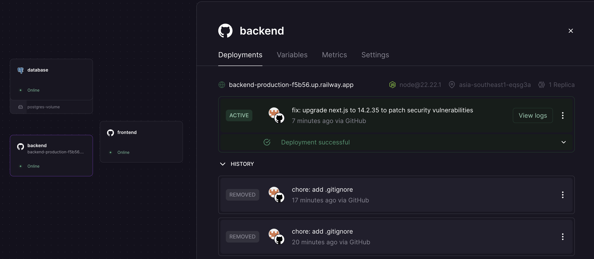
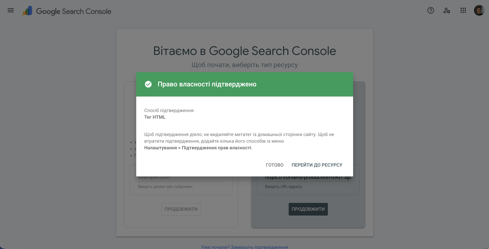

# IT Blog

Новинний блог про інформаційні технології. Проєкт розробляється в межах курсу **SEO та пошукова оптимізація**.

## Технічний стек

| Шар        | Технологія                       |
|------------|----------------------------------|
| Frontend   | Next.js 14 (App Router, SSR/SSG) |
| Backend    | Node.js + Express                |
| База даних | PostgreSQL                       |
| Хостинг    | Railway                          |

## Локальний запуск

```bash
cp .env.example .env
docker compose up -d        # запускає PostgreSQL

cd apps/backend && npm install && npm run dev   # :3001
cd apps/frontend && npm install && npm run dev  # :3000
```

---

## Лабораторна робота №1 — Звіт

### 1. URL розгорнутого сайту на Railway

`https://frontend-production-0907.up.railway.app`

### 2. Назва зареєстрованого домену

Використовується стандартний Railway домен (`.pp.ua` недоступний на момент виконання).

### 3. Скріншот успішного deploy на Railway



### 4. Вміст curl-result.txt та пояснення

```bash
curl https://frontend-production-0907.up.railway.app > curl-result.txt
```

У відповіді сервер повернув **повноцінний HTML-документ** — це результат SSR (Server-Side Rendering) у Next.js. На відміну від CSR-додатків де crawler бачить лише `<div id="root"></div>`, тут одразу присутні:

- `<title>IT Blog — Новини про технології</title>`
- `<meta name="description" content="Актуальні новини та статті про JavaScript, Backend, AI..."/>`
- Повна розмітка: `<header>`, `<nav>`, `<main>`, `<footer>` з реальним текстом
- Список категорій у навігації (JavaScript, Backend, AI & ML, Кібербезпека)

Список статей порожній (`<div class="article-grid"></div>`) оскільки база даних ще не заповнена контентом, проте сама структура сторінки повністю доступна для індексації.

### 5. Порівняльна таблиця curl vs View Page Source vs DevTools

| Джерело          | `<title>` | `<meta description>` | Текст навігації | Статті | Примітки |
|------------------|-----------|----------------------|-----------------|--------|----------|
| `curl`           | Так       | Так                  | Так             | Немає (БД порожня) | Чистий серверний HTML |
| View Page Source | Так       | Так                  | Так             | Немає | Ідентично curl — той самий SSR HTML |
| DevTools (DOM)   | Так       | Так                  | Так             | Немає | Доповнений React-атрибутами після hydration (`data-reactroot` тощо) |

**Висновок:** `curl` і View Page Source дають однаковий результат — Next.js генерує HTML на сервері до того як браузер виконає будь-який JavaScript. DevTools показує живий DOM після React hydration, але змістовно він не відрізняється. Це підтверджує що сайт коректно налаштований для індексації пошуковими системами.

### 6. Скріншот верифікації в Google Search Console



### 7. Скріншот запиту на індексацію


### 8. Що побачить Google crawler і чому це важливо

Googlebot отримає повністю сформований HTML з усіма мета-тегами та структурою сторінки вже при першому HTTP-запиті — без очікування виконання JavaScript. Це пряма перевага SSR перед CSR. Єдина поточна проблема — відсутній контент статей (порожня БД), тому crawler не знайде що індексувати окрім структури сайту. Після наповнення бази даних сайт буде повністю готовий до індексації.
