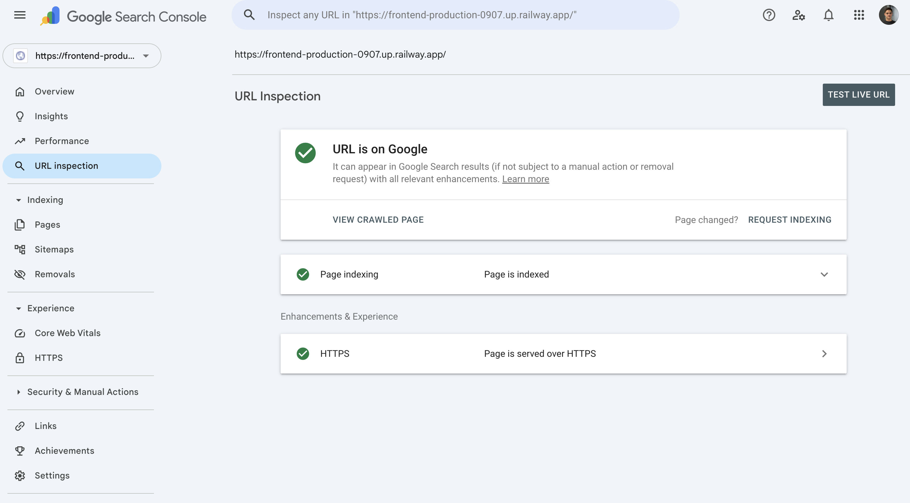
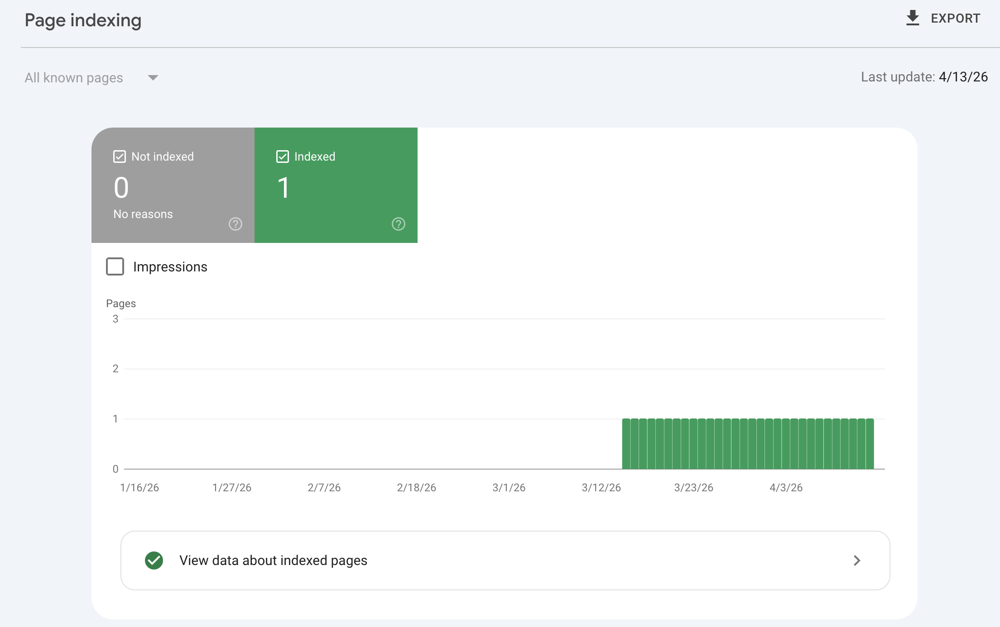
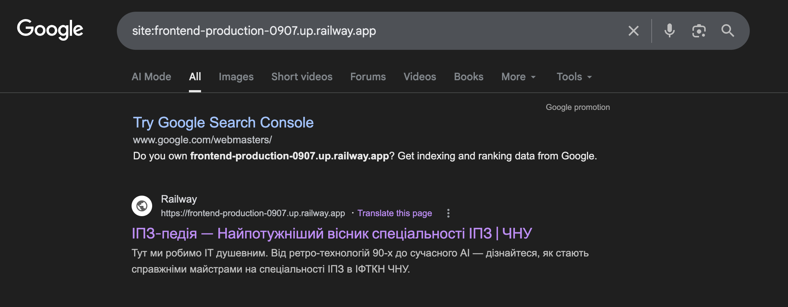
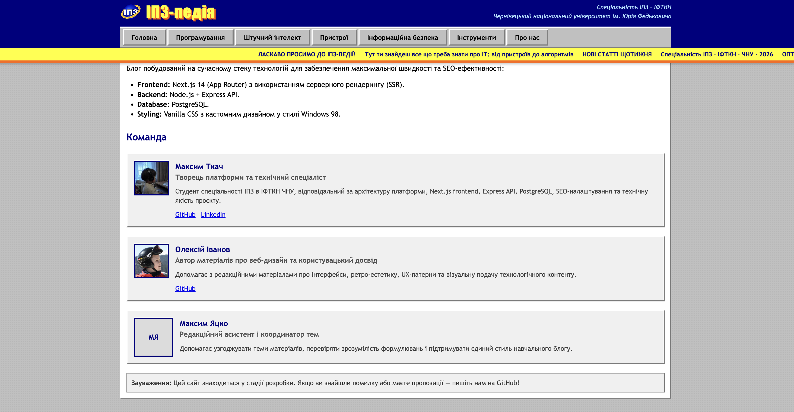
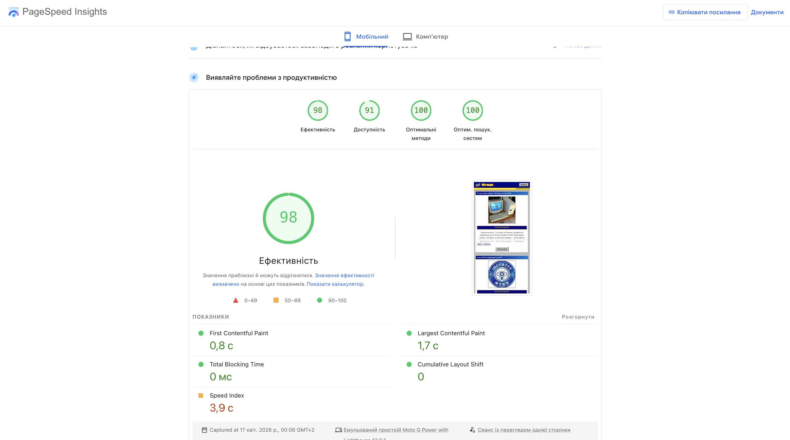
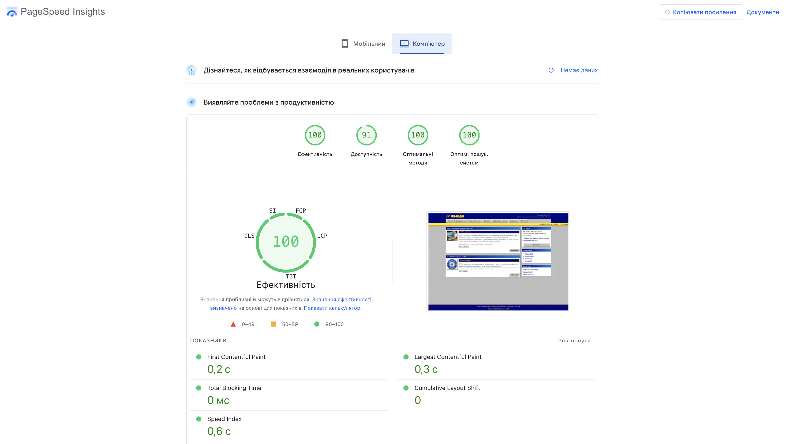
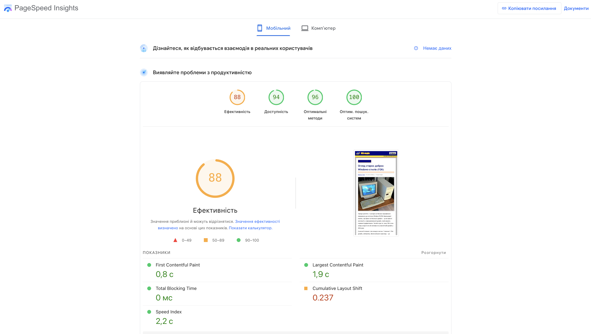
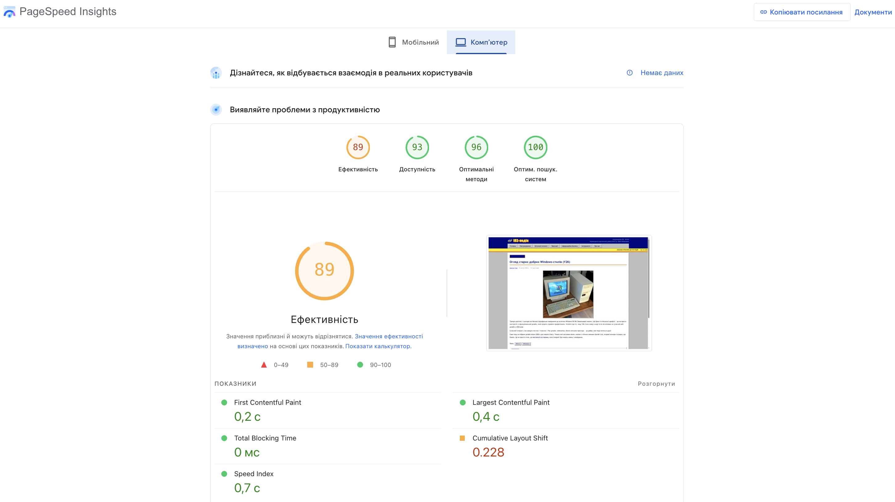

# Лабораторна робота №2. Індексація та алгоритми Google

---

## Мета

Перевірити стан індексації сайту в Google Search Console, зафіксувати базові SEO-показники нового проєкту, описати
статуси індексації, впровадити E-E-A-T-сигнали та отримати початковий PageSpeed/Lighthouse baseline для подальших
лабораторних робіт.

---

## Об'єкт аналізу

| Параметр | Значення |
|----------|----------|
| Назва сайту | ІПЗ-педія |
| URL | `https://frontend-production-0907.up.railway.app` |
| Тип сайту | навчальний IT-блог |
| Frontend | Next.js 14, App Router, SSR/SSG |
| Backend | Node.js + Express |
| База даних | PostgreSQL |

---

## 1. Перевірка поточного стану індексації

### 1.1 URL Inspection у Google Search Console

Головну сторінку було перевірено через інструмент `URL Inspection` у Google Search Console.



| Параметр | Значення |
|----------|----------|
| Статус індексації | `URL is on Google` / сторінка індексована |
| Дата останнього crawl | Не зафіксована на скріншоті, доступна у деталях `View crawled page` |
| Метод виявлення URL | Через sitemap та/або внутрішні посилання сайту |
| Чи дозволено індексацію robots.txt | Так, сторінка доступна для Googlebot |
| Чи є canonical | Очікується self-canonical для головної сторінки; потребує окремої технічної перевірки у наступній лабораторній |
| Статус рендерингу | Сторінка успішно доступна, працює через HTTPS |

Сторінка індексована і може з'являтися у Google Search results. Це позитивний результат для нового Railway-домену,
який ще не має історії та backlink-профілю.

### 1.2 Page indexing / Coverage

У звіті `Page indexing` видно, що Google наразі індексує обмежену кількість сторінок.



Поточний висновок: сайт технічно доступний для індексації, але фактична присутність у Google ще мінімальна. Для нового
навчального сайту це нормальний стан: Google може поступово обходити сторінки, особливо якщо домен не має зовнішніх
посилань, стабільної історії та регулярного трафіку.

### 1.3 Sitemap

Sitemap доступний за адресою:

```text
https://frontend-production-0907.up.railway.app/sitemap.xml
```

Sitemap було додано у Google Search Console.


Фрагмент sitemap:

```xml
<loc>https://frontend-production-0907.up.railway.app</loc>
<loc>https://frontend-production-0907.up.railway.app/about</loc>
<loc>https://frontend-production-0907.up.railway.app/articles/y2k-windows-style-review</loc>
<loc>https://frontend-production-0907.up.railway.app/articles/why-ipz-is-the-best</loc>
```

Після технічної перевірки з sitemap прибрано URL `/authors`, оскільки окремої listing-сторінки авторів немає. Це зменшує
ризик потрапляння неіснуючих або нерелевантних URL у sitemap.


### 1.4 Перевірка через пошукові оператори

Перевірено пошук через оператор `site:`.



| Оператор | Результат | Що це означає |
|----------|-----------|---------------|
| `site:frontend-production-0907.up.railway.app` | Google знаходить сторінки сайту | Сайт уже має мінімальну присутність у пошуку |
| `cache:frontend-production-0907.up.railway.app` | Не повертає корисного результату | Оператор `cache:` більше не є надійним способом перевірки кешу Google |
| `info:frontend-production-0907.up.railway.app` | Показує змішані результати, пов'язані з Railway-доменом | Через технічний Railway-домен Google може показувати не лише дані конкретного сайту, а й загальні результати про Railway |

Висновок: для нового сайту головним джерелом правди є Google Search Console, а не застарілі або нестабільні пошукові
оператори.

### 1.5 Аналіз статусів Coverage Report

| Статус | Пояснення | Можлива причина |
|--------|-----------|-----------------|
| `Submitted and indexed` | URL був надісланий через sitemap і потрапив в індекс | Сторінка доступна, має нормальний HTML, не заблокована robots.txt |
| `Crawled - currently not indexed` | Google вже обійшов сторінку, але ще не додав її в індекс | Недостатня якість/унікальність контенту, дублювання, слабкі сигнали сайту |
| `Discovered - currently not indexed` | Google знає про URL, але ще не обійшов його | Новий сайт, низький crawl priority, мало зовнішніх посилань |
| `Excluded by noindex tag` | Сторінка виключена через `noindex` | На сторінці або у HTTP-заголовку встановлено заборону індексації |
| `Blocked by robots.txt` | Googlebot не може обійти URL | У `robots.txt` є правило `Disallow` для цього шляху |
| `Redirect error` | Google зіткнувся з некоректним редіректом | Redirect loop, надто довгий redirect chain, редірект на помилковий URL |
| `404 Not Found` | Сторінка не існує | URL видалений, неправильне посилання, сторінку прибрали без редіректу |
| `Soft 404` | Сторінка формально повертає 200, але фактично виглядає як порожня або неіснуюча | Мало контенту, шаблон “нічого не знайдено” повертає статус 200 |

---

## 2. Аналіз алгоритмів Google на реальних прикладах

| Алгоритм | Рік запуску | На що впливає | Реальний кейс | Що треба робити |
|----------|-------------|---------------|---------------|-----------------|
| Panda | 2011 | Якість контенту, thin content, дублікати, content farms | eHow / Demand Media втратили видимість після Panda: [Search Engine Watch](https://www.searchenginewatch.com/2011/05/04/panda-aftermath-ehow-loses-42-of-google-search-visibility-report/) | Писати унікальні матеріали, уникати коротких шаблонних статей, додавати експертність та приклади |
| Penguin | 2012 | Якість backlink-профілю, маніпулятивні посилання, keyword-rich анкори | Interflora UK зникла з Google через платні advertorial links: [Wired](https://www.wired.com/story/interflora-disappears-from-google/) | Не купувати масові посилання, уникати exact-match спаму, будувати природний backlink-профіль |
| BERT | 2019 | Розуміння природної мови, контексту, складних запитів | Google описав BERT як великий крок у розумінні контексту запитів: [Google Blog](https://blog.google/products-and-platforms/products/search/search-language-understanding-bert/) | Писати природною мовою, відповідати на реальний інтент користувача, не займатися keyword stuffing |

Найбільш релевантний алгоритм для ІПЗ-педії зараз - **Panda / Helpful Content-підхід**, бо сайт новий і головний ризик
полягає не в посиланнях, а в якості та повноті контенту. Якщо статті будуть короткими, шаблонними або написаними лише
для ключових слів, Google може не поспішати індексувати їх.

BERT змінив підхід до контенту тим, що Google став краще розуміти сенс запиту, а не тільки точні ключові слова. Якщо
Panda бореться з низькоякісним контентом, то BERT допомагає Google зрозуміти, яка сторінка краще відповідає природному
питанню користувача. Тому текст має бути написаний для людей, із нормальною структурою та відповідями на конкретні
питання.

---

## 3. Впровадження E-E-A-T у проєкт

### 3.1 Сторінка `/about`

Сторінка `/about` створена і містить:

- назву та опис проєкту;
- місію сайту;
- технічний стек;
- команду;
- контакт через email/GitHub;
- дату/контекст створення навчального проєкту.



### 3.2 Профілі та ролі авторів

У проєкті додано E-E-A-T-профілі команди:

| Автор | Роль | E-E-A-T сигнал |
|-------|------|----------------|
| Максим Ткач | Творець платформи та технічний спеціаліст | Відповідає за frontend, backend, PostgreSQL, SEO-налаштування, sitemap, robots.txt і деплой |
| Олексій Іванов | Автор матеріалів про веб-дизайн та UX | Має аватар, біографію, авторство статті про Y2K/Windows-стиль |
| Максим Яцко | Редакційний асистент і координатор тем | Допомагає підтримувати стиль матеріалів і узгоджувати теми |

### 3.3 Підпис автора на сторінці статті

На сторінці статті є авторський блок: ім'я автора, аватар, біографія, дата публікації та дата оновлення.


### 3.4 E-E-A-T чек-ліст

| Напрям | Стан | Коментар |
|--------|------|----------|
| Experience | Частково виконано | Є власний навчальний проєкт і приклади реалізації, але треба більше практичних кейсів у статтях |
| Expertise | Виконано | Автори мають біографії, ролі та прив'язку до тематики ІПЗ/веброзробки |
| Authoritativeness | Частково виконано | Є `/about`, автори та GitHub, але backlink-профіль ще слабкий |
| Trustworthiness | Виконано частково | Сайт працює через HTTPS, є контакт, дати статей; потрібно регулярно перевіряти биті посилання |

Найслабші місця E-E-A-T зараз:

1. Недостатньо зовнішніх посилань на сайт.
2. Мало фактичних авторських кейсів у статтях.
3. Потрібно більше посилань на авторитетні джерела в матеріалах.

План покращення: додати більше довгих статей з прикладами коду, оформити джерела, поступово отримати релевантні
backlinks із навчальних/технічних ресурсів.

---

## 4. Базовий PageSpeed / Lighthouse звіт

Перевірено головну сторінку:

```text
https://frontend-production-0907.up.railway.app
```





### 4.1 Метрики головної сторінки

| Метрика | Mobile | Desktop |
|---------|--------|---------|
| Performance Score | 98 | 100 |
| SEO Score | 100 | 100 |
| Accessibility Score | 91 | 91 |
| Best Practices Score | 100 | 100 |
| LCP | 1.7 s | 0.3 s |
| CLS | 0 | 0 |
| INP | Немає field data | Немає field data |
| FCP | 0.8 s | 0.2 s |
| TTFB | Не зафіксовано на скріншоті | Не зафіксовано на скріншоті |
| TBT | 0 ms | 0 ms |
| Speed Index | 3.9 s | 0.6 s |

### 4.2 Аналіз результатів

Червоних метрик на головній сторінці немає. Mobile Performance дорівнює 98, Desktop - 100. Це означає, що головна
сторінка швидко завантажується, не має помітного layout shift і не блокує взаємодію користувача важким JavaScript.

Потенційні проблеми:

1. `Speed Index` на Mobile дорівнює 3.9 s, тобто візуальне заповнення сторінки на мобільному повільніше, ніж на desktop.
2. Немає польових даних INP, бо сайт новий і не має достатнього обсягу реальних користувацьких даних у CrUX.
3. Accessibility Score 91: треба перевірити контраст, alt-тексти й семантику навігації.

Desktop кращий за Mobile, бо комп'ютерна перевірка емулює потужніший пристрій і стабільнішу мережу. Mobile-аналіз
жорсткіший: він симулює повільніший CPU та мобільні умови завантаження.

Окремо для майбутньої оптимізації перевірено сторінку статті:





На статті видно проблему CLS: `0.237` на mobile і `0.228` на desktop. Це буде пріоритетною задачею для лабораторної №6:
потрібно зафіксувати розміри зображень/блоків, щоб сторінка не зсувалася під час завантаження.

---

## Контрольні питання

1. **Що означає `Discovered - currently not indexed`?**  
   Google знає про URL, але ще не обійшов його. Причини: новий сайт, низький crawl priority, мало посилань, обмежений
   crawl budget.

2. **Різниця між crawling та indexing.**  
   Crawling - це обхід сторінки роботом. Indexing - додавання сторінки в індекс. Сторінка може бути crawled, але не
   indexed, якщо Google не вважає її достатньо цінною або бачить дублювання.

3. **Що таке crawl budget?**  
   Це умовна кількість сторінок, які Google готовий обійти на сайті за певний час. Для великих сайтів він важливий, бо
   помилки, дублікати й зайві URL можуть витрачати обхід на непотрібні сторінки.

4. **Що означає E-E-A-T?**  
   Experience - досвід, Expertise - експертиза, Authoritativeness - авторитетність, Trustworthiness - надійність.

5. **Що таке LCP, CLS та INP?**  
   LCP вимірює швидкість появи основного контенту, добра межа - до 2.5 s. CLS вимірює візуальні зсуви, добра межа -
   до 0.1. INP вимірює реакцію сторінки на взаємодію, добра межа - до 200 ms. Порогові значення взято з документації
   Google Search Central: https://developers.google.com/search/docs/appearance/core-web-vitals.

6. **Приклади thin content для сайту.**  
   Коротка стаття на 2 абзаци без прикладів; новина, переписана з іншого сайту без власного аналізу; сторінка категорії
   без опису і без статей. Уникати цього можна через повні матеріали, власні пояснення, джерела й практичні приклади.

7. **Чому BERT змінив підхід до keyword stuffing?**  
   BERT допомагає Google розуміти контекст слів у запиті. Тому повторювати ключове слово багато разів менш корисно, ніж
   дати чітку відповідь на інтент користувача.

8. **Причини низького Mobile Performance.**  
   Важкі зображення, зайвий JavaScript, layout shift через відсутні розміри зображень. Виправлення: WebP/AVIF,
   оптимізація JS, `width`/`height`, lazy loading для некритичних зображень.

9. **Чому Google цінує авторство?**  
   Авторство допомагає зрозуміти, хто відповідає за контент і чи має ця людина компетентність. Це пов'язано з Helpful
   Content-підходом: корисний контент має бути створений для людей і мати зрозуміле джерело.

10. **Що таке Soft 404?**  
    Це сторінка, яка повертає HTTP 200, але за змістом виглядає як відсутня. Вона небезпечна тим, що Google витрачає
    crawl budget на порожні сторінки і може гірше довіряти якості сайту.

11. **Три слабкі місця E-E-A-T.**  
    Слабкий backlink-профіль, мало практичних кейсів, мало зовнішніх джерел у статтях. План: посилити контент, додати
    джерела, розвивати природні посилання.

12. **Що робити після втрати 40% трафіку після Helpful Content update?**  
    Перевірити Search Console, знайти сторінки з найбільшим падінням, порівняти їх з конкурентами, покращити контент,
    об'єднати дублікати, оновити авторство й джерела, перевірити технічні помилки.

13. **Порівняння з відомим IT-блогом.**  
    У великих ресурсів зазвичай сильніший backlink-профіль, більше авторів, більше довгих матеріалів і стабільніша
    історія домену. ІПЗ-педія технічно швидка, але ще слабка за авторитетністю та обсягом контенту.

14. **Які Core Web Vitals впливають на ранжування?**  
    Google використовує Core Web Vitals як частину page experience signals. Основні CWV: LCP, INP і CLS. Вони не
    замінюють релевантність контенту, але можуть впливати на оцінку сторінки, особливо коли сторінки мають схожу
    релевантність.

---

## Висновок

Сайт ІПЗ-педія вже індексується Google: головна сторінка має статус `URL is on Google`, sitemap додано в GSC, а пошуковий
оператор `site:` знаходить сторінки. Водночас індексація поки обмежена, що нормально для нового Railway-домену без
історії та backlink-профілю.

E-E-A-T-сигнали покращено: є сторінка `/about`, команда, авторські ролі, аватари, профілі та блок автора у статті.
PageSpeed baseline для головної сторінки дуже добрий: 98 на Mobile і 100 на Desktop. Основна технічна проблема, яку
потрібно винести в наступні лабораторні, - CLS на сторінці статті.
