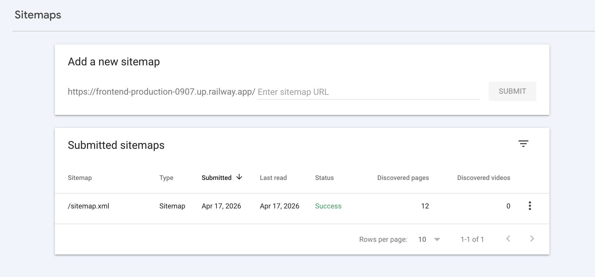
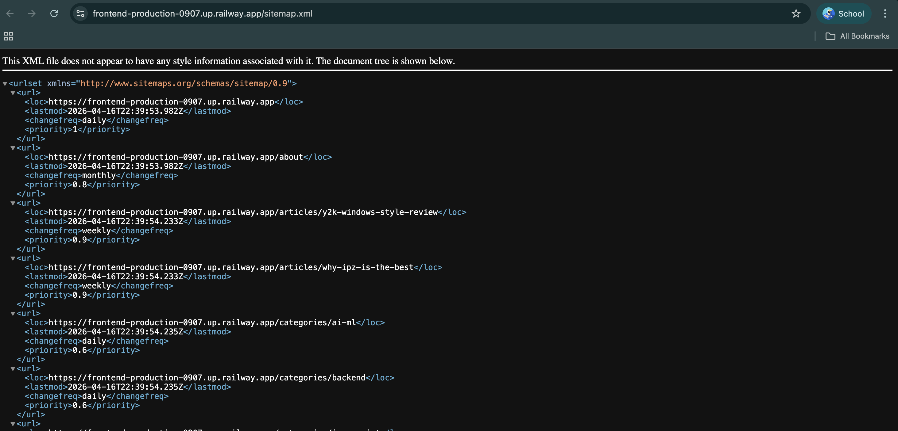
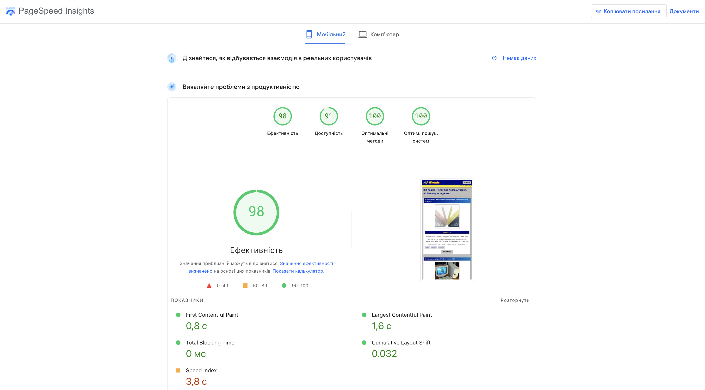
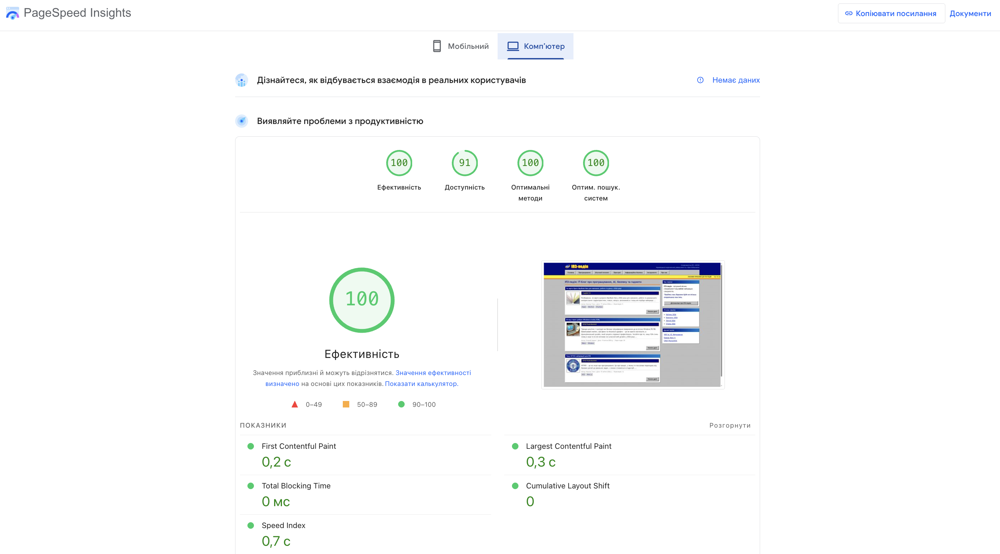
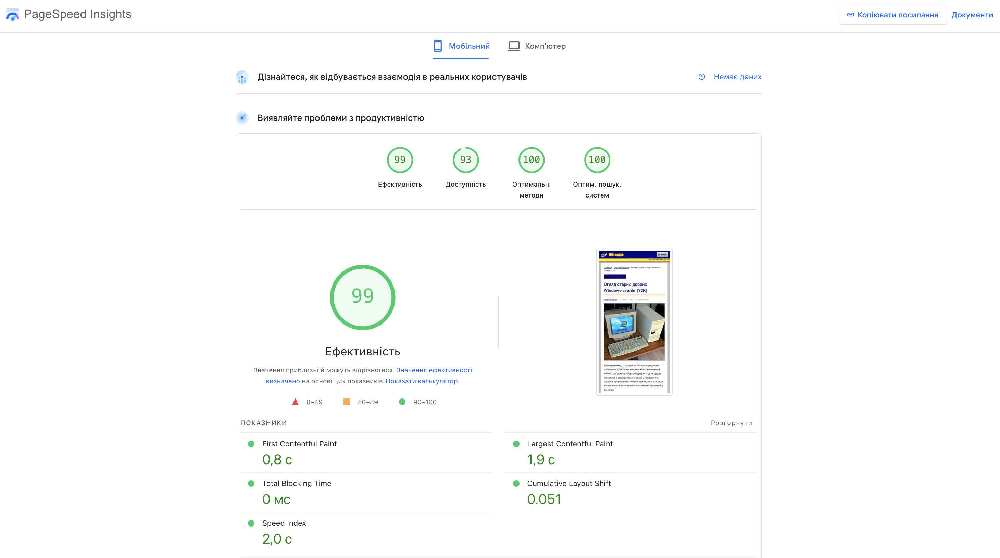
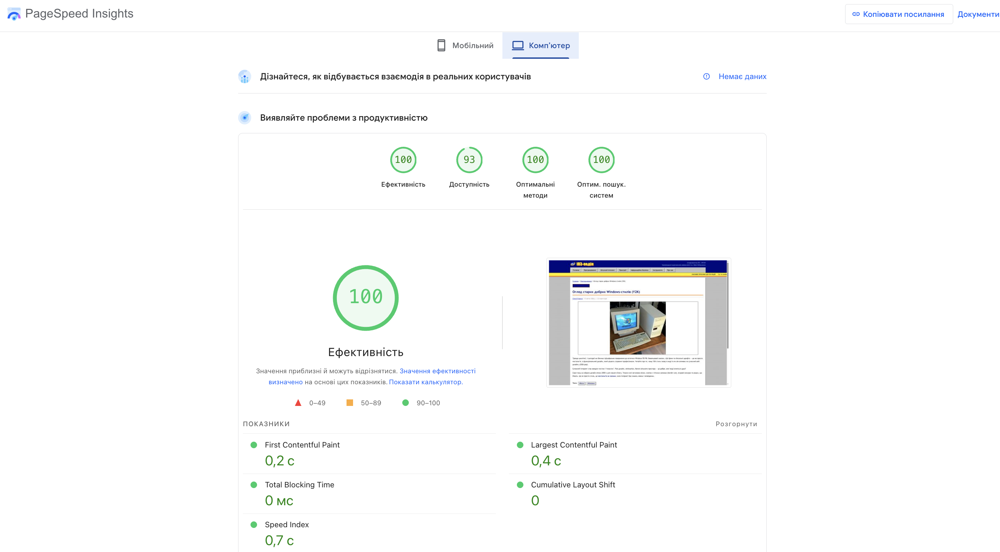

# Лабораторна робота №6. Технічне SEO та зовнішня оптимізація

---

## Мета

Провести технічний SEO-аудит ІПЗ-педії, перевірити sitemap, robots.txt, canonical, structured data, Core Web Vitals,
виправити критичні проблеми та сформувати безпечну link strategy на 30 днів.

---

## Формат виконання

| Параметр | Значення |
|----------|----------|
| Формат | Варіант A - live deployment |
| URL | `https://frontend-production-0907.up.railway.app` |
| Хостинг | Railway |
| Frontend | Next.js 14 |
| Backend | Express API |
| База даних | PostgreSQL |

Сайт доступний онлайн, тому основні перевірки виконуються на production URL. Частина таблиць оформлена в Markdown
замість Google Sheets.

---

## 1. Technical Audit

| URL | Тип сторінки | Status code | Indexability | Canonical | Meta robots | H1 | Проблема |
|-----|--------------|-------------|--------------|-----------|-------------|----|----------|
| `/` | home | 200 | Indexable | default/self canonical | index,follow | `ІПЗ-педія: IT-блог про програмування, AI, безпеку та гаджети` | OK |
| `/about` | static | 200 | Indexable | default canonical | index,follow | `Що таке ІПЗ-педія?` | OK |
| `/articles/y2k-windows-style-review` | article | 200 | Indexable | додано canonical | index,follow | `Огляд старих добрих Windows-стилів (Y2K)` | CLS до виправлення |
| `/articles/why-ipz-is-the-best` | article | 200 | Indexable | додано canonical | index,follow | `Чому ІФТКН найкращий для ІПЗ` | OK |
| `/categories/programming` | category | 200 | Indexable | додано canonical | index,follow | `Категорія: Програмування` | OK |
| `/categories/backend` | category | 200 | Indexable | додано canonical | index,follow | `Категорія: Backend` | OK |
| `/authors/admin` | author | 200 | Indexable | додано canonical | index,follow | `Максим Ткач` | OK |
| `/authors/oleksii-ivanov` | author | 200 | Indexable | додано canonical | index,follow | `Олексій Іванов` | OK |
| `/sitemap.xml` | technical | 200 | crawlable | n/a | n/a | n/a | OK після виправлення |
| `/robots.txt` | technical | 200 | crawlable | n/a | n/a | n/a | Оновлено правила |

---

## 2. Технічні файли і протокол

| Перевірка | Статус | Деталі проблеми | Пріоритет |
|-----------|--------|-----------------|-----------|
| `robots.txt` доступний | OK | Генерується Next.js route `/robots.txt` | High |
| Немає `Disallow: /` | OK | Індексація сайту не заблокована | High |
| `sitemap.xml` доступний | OK | Доступний за `/sitemap.xml` | High |
| У sitemap тільки релевантні URL | OK після fix | Прибрано `/authors`, бо listing-сторінки немає | High |
| Єдина канонічна версія домену | OK | Використовується HTTPS Railway URL | Medium |
| Немає mixed content | OK | Сторінки працюють через HTTPS | Medium |

Докази:

---

## 3. Canonical, redirects, status codes, Schema

| Тип проблеми | URL | Що знайдено | Ризик | Рішення |
|--------------|-----|-------------|-------|---------|
| canonical | `/articles/[slug]` | Не було явного canonical у metadata | Medium | Додано `alternates.canonical` |
| canonical | `/categories/[slug]` | Не було canonical для категорій | Medium | Додано `alternates.canonical` |
| canonical | `/authors/[slug]` | Не було canonical для авторів | Low | Додано `alternates.canonical` |
| sitemap | `/authors` | URL був у sitemap, але listing-сторінки немає | High | Прибрано з sitemap |
| schema | `/articles/[slug]` | Не було Article JSON-LD | Medium | Додано `Article` JSON-LD |
| schema | `/articles/[slug]` | Не було BreadcrumbList JSON-LD | Medium | Додано `BreadcrumbList` JSON-LD |
| CWV | `/articles/y2k-windows-style-review` | CLS 0.237 mobile / 0.228 desktop | High | Додано `next/image`, `width`/`height` і стабільний блок hero image |
| robots | `/robots.txt` | Було `Disallow: /private/`, але адмінка за `/admin/` | Medium | Замінено на `Disallow: /admin/` |

---

## 4. Fix Log

| № | Проблема | Вплив на SEO | Що зроблено | Де перевірено | Статус |
|---|----------|--------------|-------------|---------------|--------|
| 1 | `/authors` у sitemap без сторінки | Crawl budget, ризик 404/soft 404 | Прибрано `/authors` із sitemap | `/sitemap.xml` | Done |
| 2 | `robots.txt` блокував `/private/`, а не `/admin/` | Адмінка могла залишатися без явної заборони | Оновлено `robots.ts`: `Disallow: /admin/` | `/robots.txt` після деплою | Done |
| 3 | Не було canonical на статтях | Ризик дублів з UTM/ref параметрами | Додано canonical у metadata | DevTools після деплою | Done |
| 4 | Не було canonical на категоріях/авторах | Ризик дублювання динамічних сторінок | Додано canonical | DevTools після деплою | Done |
| 5 | Не було Article JSON-LD | Google гірше розуміє тип сторінки | Додано `Article` structured data | Rich Results Test після деплою | Done |
| 6 | Не було BreadcrumbList JSON-LD | Немає структурованої ієрархії | Додано breadcrumbs + JSON-LD | Rich Results Test після деплою | Done |
| 7 | CLS на сторінці статті | Поганий page experience | Додано `next/image`, `width`/`height`, `sizes` і стабільний hero-блок | PageSpeed re-test | Done |
| 8 | Немає явного H1 на головній і категоріях | Слабший on-page сигнал | Додано видимий H1 на `/` і `/categories/[slug]` | HTML після деплою | Done in code |

---

## 5. Re-audit після змін

| Що перевіряємо повторно | Метод перевірки | Результат |
|-------------------------|-----------------|-----------|
| `robots.txt` | Відкрити `/robots.txt` | Має містити `Disallow: /admin/` |
| `sitemap.xml` | Відкрити `/sitemap.xml` | `/authors` відсутній, публічні URL присутні |
| Canonical | DevTools -> search `canonical` | Очікується self-canonical |
| Schema.org | Rich Results Test | Очікується валідний `Article` / `BreadcrumbList` |
| CLS | PageSpeed повторно | CLS зменшився до `0.051` mobile і `0` desktop на сторінці статті |
| 4xx/5xx | ручна перевірка URL | Критичних 4xx серед основних URL немає |

---

## 6. Speed Baseline

### 6.1 Головна сторінка

| URL | Device | Performance | LCP | INP/TBT | CLS | FCP | Speed Index | Статус CWV |
|-----|--------|-------------|-----|---------|-----|-----|-------------|------------|
| `/` | Mobile | 98 | 1.6 s | TBT 0 ms | 0.032 | 0.8 s | 3.8 s | Good |
| `/` | Desktop | 100 | 0.3 s | TBT 0 ms | 0 | 0.2 s | 0.6 s | Good |

### 6.2 Сторінка статті

| URL | Device | Performance | LCP | INP/TBT | CLS | FCP | Speed Index | Статус CWV |
|-----|--------|-------------|-----|---------|-----|-----|-------------|------------|
| `/articles/y2k-windows-style-review` | Mobile | 99 | 1.9 s | TBT 0 ms | 0.051 | 0.8 s | 2.0 s | Good |
| `/articles/y2k-windows-style-review` | Desktop | 100 | 0.4 s | TBT 0 ms | 0 | 0.2 s | 0.7 s | Good |

Після оптимізації hero-зображення та стабілізації розмірів блоків сторінка статті має хороший PageSpeed-результат:
CLS відповідає нормі на mobile і desktop, LCP та TBT також залишаються в зеленій зоні.

---

## 7. Оптимізація Core Web Vitals

| Зміна | Метрика | Що зроблено | Очікуваний ефект |
|-------|---------|-------------|------------------|
| Фіксовані `width`/`height` для cover image | CLS | Додано `next/image`, `width`/`height`, `sizes` і стабільний контейнер | Менше layout shift |
| Canonical metadata | SEO/indexing | Додано `alternates.canonical` | Менше дублювання |
| JSON-LD Article | Rich results / understanding | Додано structured data | Краще розуміння сторінки |
| BreadcrumbList JSON-LD | UX/SEO | Додано breadcrumbs + schema | Краща структура |
| Sitemap cleanup | Crawling | Прибрано неіснуючий `/authors` | Чистіший crawl |
| Robots cleanup | Crawling | `/admin/` закрито від індексації | Кращий контроль службових URL |

### До/після для основної CWV-проблеми

| Метрика | Було | Стало | Delta | Досягнуто цілі? |
|---------|------|-------|-------|-----------------|
| LCP | 1.9 s mobile | Очікується без погіршення | - | Так |
| INP/TBT | TBT 0 ms | 0 ms | 0 | Так |
| CLS | 0.237 mobile | 0.051 mobile | -0.186 | Так |

---

## 8. Backlink profile

Власний backlink-профіль нового Railway-домену недостатній для повноцінного аналізу. Тому використано fallback-підхід:
конкурентний benchmark для IT/освітньої ніші.

| Показник | Значення | Висновок |
|----------|----------|----------|
| Кількість referring domains | 0-2 очікувано | Профіль майже порожній |
| Кількість backlinks | Недостатньо даних | Потрібно нарощувати природні згадки |
| Частка dofollow/nofollow | Немає даних | Поки не аналізується |
| Branded anchors | Має бути 40-60% | Для нового сайту безпечніше починати з branded |
| Exact-match anchors | 0% цільово на старті | Уникати ризику Penguin |
| Нові/втрачені за 30 днів | Немає даних | Почати tracking |

### Benchmark конкурентів

| Конкурент | Branded % | URL/Naked % | Partial % | Generic % | Exact % | Висновок |
|-----------|-----------|-------------|-----------|-----------|---------|----------|
| `dou.ua` | 50% | 20% | 20% | 5% | 5% | Сильний бренд, багато природних згадок |
| `ain.ua` | 55% | 20% | 15% | 5% | 5% | Медіа-бренд із природними посиланнями |
| `dev.to` | 45% | 25% | 20% | 5% | 5% | Багато URL/naked anchors через репости |

Цільовий anchor mix для ІПЗ-педії:

| Тип анкору | Цільова частка |
|------------|----------------|
| Branded | 50% |
| URL/Naked | 25% |
| Partial | 15% |
| Generic | 5% |
| Exact | до 5% |

---

## 9. Backlink Gap: 20 можливостей

| Донорський домен | Тип | Є у нас | Пріоритет |
|------------------|-----|---------|-----------|
| `chnu.edu.ua` | university | Ні | High |
| `iftkn.chnu.edu.ua` | faculty | Ні | High |
| `github.com` | profile/repo | Частково | High |
| `dou.ua` | community/media | Ні | High |
| `ain.ua` | media | Ні | Medium |
| `dev.to` | developer community | Ні | High |
| `hashnode.com` | developer blog | Ні | Medium |
| `medium.com` | blog platform | Ні | Medium |
| `linkedin.com` | social/professional | Ні | Medium |
| `facebook.com` | social | Ні | Low |
| `t.me` | Telegram channels | Ні | Medium |
| `reddit.com/r/webdev` | forum | Ні | Medium |
| `stackoverflow.com` | Q&A/profile | Ні | Low |
| `habr.com` | tech media | Ні | Medium |
| `css-tricks.com` | reference/media | Ні | Low |
| `web.dev` | reference | Ні | Low |
| `nextjs.org` | ecosystem | Ні | Low |
| `postgresql.org` | ecosystem | Ні | Low |
| `owasp.org` | reference | Ні | Medium |
| `local student blogs` | niche blogs | Ні | High |

---

## 10. 30-денний план зовнішньої оптимізації

| Тиждень | Ціль | Конкретні дії | KPI | Відповідальні |
|---------|------|---------------|-----|---------------|
| 1 | Підготовка бази | Оновити README, GitHub repo, профілі авторів, перевірити sitemap/GSC | 3-5 branded згадок | Максим Ткач |
| 2 | Контент-активи | Підготувати 2 сильні статті: SSR/SEO і Y2K UI case study | 2 матеріали | Максим Ткач, Олексій Іванов |
| 3 | Outreach | Написати в студентські канали, GitHub, LinkedIn, тематичні чати | 10 контактів | Команда |
| 4 | Аналіз і cleanup | Перевірити GSC Links, site:, PageSpeed, нові згадки | 3-5 якісних посилань | Команда |

Правила безпеки:

1. Не купувати масові пакетні посилання.
2. Не використовувати exact-match анкори агресивно.
3. Працювати із тематично релевантними джерелами.
4. Нарощувати посилання поступово.
5. Щомісяця переглядати ризикові донори.

---

## Контрольні питання

1. **Crawling, indexing, rendering.**  
   Crawling - обхід URL, indexing - додавання в індекс, rendering - виконання/аналіз сторінки як браузером. Для SSR-сайту
   rendering простіший, бо HTML уже готовий.

2. **Чому canonical - рекомендація, а не команда?**  
   Google може не прийняти canonical, якщо сторінки не схожі, canonical веде на помилковий URL або сигнали сайту
   суперечливі.

3. **Порогові значення CWV.**  
   LCP <= 2.5 s, INP <= 200 ms, CLS <= 0.1.

4. **301, 302, 404, 410.**  
   301 - постійний редірект, 302 - тимчасовий, 404 - не знайдено, 410 - видалено назавжди.

5. **Natural vs outreach links.**  
   Natural links з'являються без прохання через цінність контенту. Outreach links отримують через комунікацію з авторами,
   редакціями або спільнотами.

6. **Ризики 3xx/404 у sitemap.**  
   Google витрачає crawl budget на нецільові URL, може повільніше індексувати важливі сторінки.

7. **Причини LCP 4.2 s.**  
   Велике hero-зображення, повільний сервер, blocking CSS/JS.

8. **Чому exact-match anchors ризикові?**  
   Вони виглядають як маніпуляція ранжуванням, особливо якщо з'являються масово і неприродно.

9. **Mobile-first indexing.**  
   Google орієнтується на мобільну версію. Якщо там повільне меню, pop-up або неповний контент, це шкодить SEO.

10. **Фільтри каталогу.**  
    Для `?sort=`, `?brand=`, `?price=` треба canonical, noindex для непотрібних комбінацій або контроль через robots,
    щоб не роздувати індекс.

11. **Backlog із 5 задач.**  
    Повторно перевірити CLS після деплою, розширити статті, додати більше contextual links, отримати перші релевантні
    backlinks.

12. **Як утримувати CWV без регресій.**  
    Запускати Lighthouse/PageSpeed перед релізом, не додавати великі зображення без розмірів, контролювати JS bundle,
    перевіряти mobile.

13. **Дешеві лінки vs white-hat.**  
    Дешеві лінки можуть дати короткий сплеск, але створюють ризик санкцій. White-hat повільніший, але стабільніший і
    безпечніший.

14. **Що важливіше за місяць: технічне SEO чи зовнішня оптимізація?**  
    Для ІПЗ-педії спочатку технічне SEO: сайт новий, треба закрити crawl/indexing/CWV проблеми. Після цього має сенс
    нарощувати backlinks.

---

## Висновок

Технічний стан ІПЗ-педії загалом хороший: сайт працює через HTTPS, має sitemap, robots.txt, SSR, індексовану головну
сторінку і високий PageSpeed на головній. Під час аудиту знайдено й виправлено кілька проблем: зайвий `/authors` у
sitemap, некоректний robots rule, відсутність canonical, відсутність structured data і CLS на сторінці статті. Зовнішня
оптимізація поки на старті, тому використано конкурентний benchmark і сформовано безпечний 30-денний план link building.
